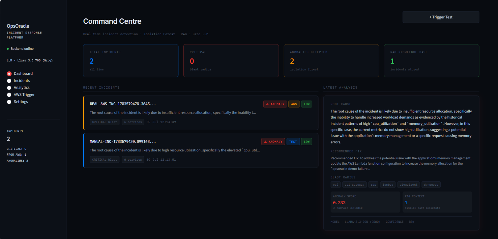
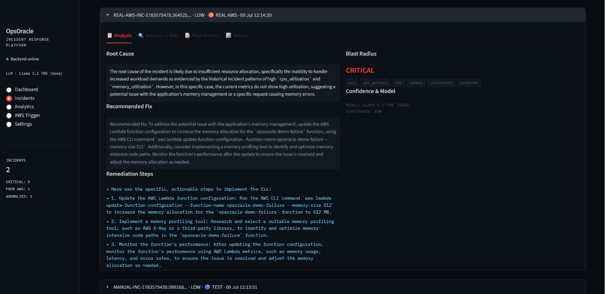
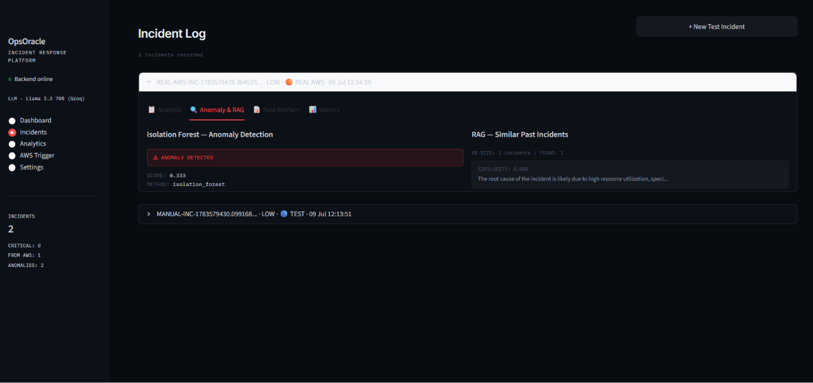
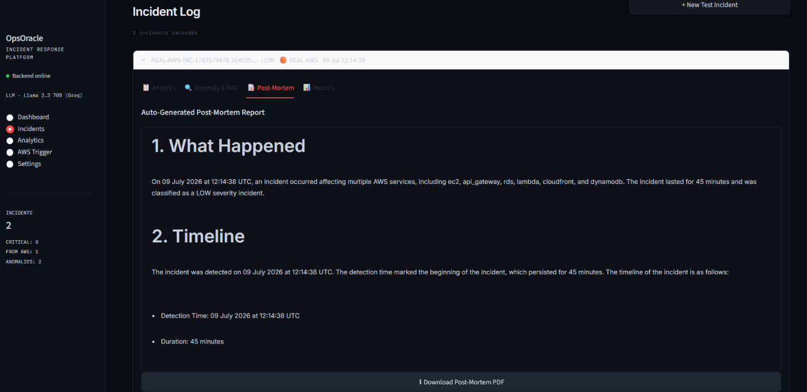
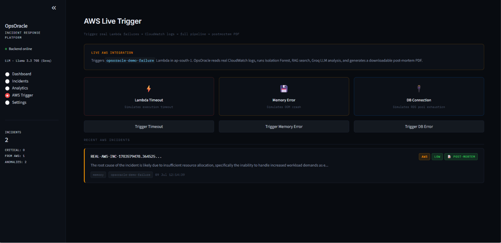
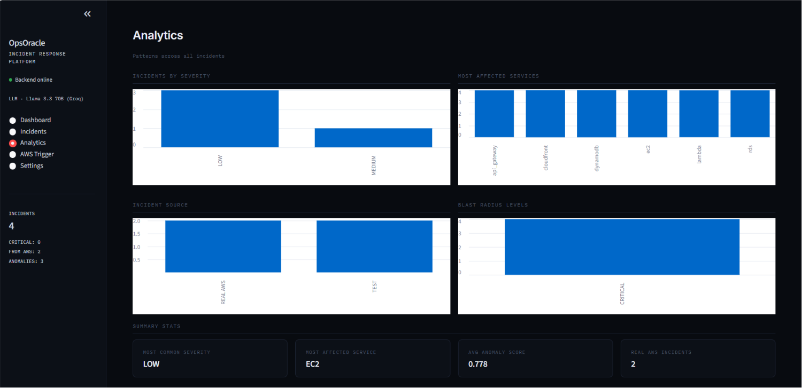

# OpsOracle — Autonomous AI Incident Response System

> Detects, diagnoses, and remediates cloud infrastructure failures in under 60 seconds.
> Human engineers take 45 minutes. OpsOracle does it autonomously.



---

## What It Does

When a cloud service fails, OpsOracle runs a full 8-step autonomous pipeline:

1. **Parses** CloudWatch logs into structured incident data
2. **Maps blast radius** — detects all cascading service failures via dependency graph
3. **Detects anomalies** — Isolation Forest ML on 5 real-time metrics
4. **Searches memory** — RAG pipeline finds similar past incidents using semantic embeddings
5. **Analyses root cause** — Llama 3.3 70B via Groq API with full context
6. **Generates fix** — specific AWS CLI commands and remediation steps
7. **Writes post-mortem** — full structured report auto-generated by LLM
8. **Exports PDF** — professional post-mortem downloadable in one click

**Simulated MTTR: 45 minutes → under 60 seconds**

---

## Demo

### Dashboard — Real-time Command Centre


### Incident Analysis — Root Cause, Fix, Blast Radius


### Anomaly Detection & RAG Context


### Auto-Generated Post-Mortem Report


### AWS Live Trigger — Real Lambda Failures


### Analytics — Patterns Across Incidents


---

## Tech Stack

| Layer | Technology | Why |
|---|---|---|
| Backend | FastAPI + Python 3.12 | Async API, auto Swagger docs, Pydantic validation |
| Frontend | Streamlit | Rapid ML dashboard, custom dark CSS theme |
| LLM | Groq API — Llama 3.3 70B | Free tier, fast inference, strong technical reasoning |
| Anomaly Detection | Scikit-learn Isolation Forest | Unsupervised, no labeled data needed |
| RAG | LangChain + Sentence Transformers | Semantic search over incident history |
| Embeddings | all-MiniLM-L6-v2 (384 dimensions) | Fast, local, production-quality embeddings |
| Vector Search | Cosine similarity (Pinecone-ready) | Meaning-based search, not keyword matching |
| Cloud | AWS (CloudWatch, Lambda, EC2, X-Ray, RDS) | Real cloud integration |
| PDF | ReportLab | Programmatic post-mortem PDF generation |
| Config | python-dotenv | Secure API key management |
| Logging | Loguru | Structured logging to file and console |

---

## Architecture

```
┌─────────────────┐     ┌────────────────────────────────────────────┐
│   STREAMLIT     │────▶│              FASTAPI BACKEND               │
│   port: 8501    │◀────│                                            │
└─────────────────┘     │  POST /api/incidents/analyze               │
                         │         │                                  │
┌─────────────────┐     │         ▼  run_full_pipeline()             │
│   AWS LAMBDA    │     │  1. log_parser.parse_raw_logs()            │
│  (real failure) │     │  2. blast_radius_service.detect_cascade()  │
└────────┬────────┘     │  3. anomaly_detector.predict()             │
         │              │     └─ Isolation Forest                    │
┌────────▼────────┐     │  4. rag_service.search_similar()           │
│   CLOUDWATCH    │────▶│     └─ Sentence Transformers + Cosine Sim  │
│  Logs + Metrics │     │  5. llm_agent.analyze_incident()           │
└─────────────────┘     │     └─ Groq API (Llama 3.3 70B)           │
                         │  6. llm_agent.write_postmortem()           │
┌─────────────────┐     │  7. pdf_generator.generate_pdf()           │
│   GROQ API      │◀───▶│     └─ ReportLab                          │
│  Llama 3.3 70B  │     │  8. alert_service + rag_service.store()    │
└─────────────────┘     └────────────────────────────────────────────┘
```

---

## Project Structure

```
OpsOracle/
├── backend/
│   ├── agents/
│   │   ├── llm_agent.py           # Groq LLM — analysis + postmortem
│   │   └── remediation_agent.py   # Autonomous fix execution
│   ├── services/
│   │   ├── aws_manager.py         # CloudWatch, Lambda, EC2, X-Ray
│   │   ├── log_parser.py          # Log parsing + blast radius
│   │   ├── rag_service.py         # Embeddings + semantic search
│   │   ├── blast_radius_service.py# Service dependency graph
│   │   └── alert_service.py       # Incident storage
│   ├── ml/
│   │   └── anomaly_detector.py    # Isolation Forest model
│   ├── routers/
│   │   ├── incidents.py           # Core pipeline endpoint
│   │   ├── metrics.py
│   │   ├── remediation.py
│   │   └── postmortem.py
│   ├── utils/
│   │   └── pdf_generator.py       # ReportLab PDF generation
│   ├── main.py                    # FastAPI app entry point
│   └── config.py                  # Environment configuration
├── frontend/
│   └── app.py                     # Streamlit dashboard
├── ml_models/                     # Trained Isolation Forest model
├── docs/                          # Screenshots for README
├── .env                           # API keys (not in git)
├── requirements.txt
└── README.md
```

---

## Quick Start

### 1. Clone
```bash
git clone https://github.com/GauravSindhi/OpsOracle.git
cd OpsOracle
```

### 2. Create virtual environment
```bash
python -m venv venv
venv\Scripts\activate      # Windows
source venv/bin/activate   # Mac/Linux
```

### 3. Install dependencies
```bash
pip install -r requirements.txt
```

### 4. Configure environment
```bash
cp .env.example .env
```

Edit `.env`:
```env
GROQ_API_KEY=gsk_your_key_from_console.groq.com
AWS_ACCESS_KEY_ID=your_aws_key
AWS_SECRET_ACCESS_KEY=your_aws_secret
AWS_REGION=ap-south-1
```

Get your **free** Groq API key (no credit card) at: https://console.groq.com/keys

### 5. Run backend
```bash
python -m backend.main
```
API runs at: `http://localhost:8000`
Swagger docs: `http://localhost:8000/docs`

### 6. Run frontend
```bash
streamlit run frontend/app.py
```
Dashboard: `http://localhost:8501`

---

## Testing the Pipeline

### Option A — From Streamlit Dashboard
Click **"+ Trigger Test"** on the Dashboard page.

### Option B — From FastAPI Docs
Go to `http://localhost:8000/docs` → `POST /api/incidents/analyze`:

```json
{
  "logs": {
    "summary": "Lambda function timeout error detected",
    "error_count": 15,
    "warning_count": 3
  },
  "metrics": {
    "cpu_utilization": 92,
    "memory_utilization": 88,
    "request_latency": 850,
    "error_rate": 0.35,
    "request_count": 1200
  },
  "service": "lambda"
}
```

### Option C — Real AWS (requires Lambda deployed)
Go to **AWS Trigger** page → click any of the 3 failure buttons.

---

## API Endpoints

| Method | Endpoint | Description |
|---|---|---|
| GET | `/api/incidents/` | List all incidents |
| POST | `/api/incidents/analyze` | Full pipeline — test incident |
| POST | `/api/incidents/trigger-aws-incident` | Real AWS Lambda trigger |
| GET | `/api/incidents/{id}` | Get specific incident |
| GET | `/api/incidents/{id}/postmortem` | Get post-mortem text |
| GET | `/api/incidents/{id}/postmortem/pdf` | Download post-mortem PDF |
| GET | `/api/incidents/stats/overview` | Statistics summary |

---

## Key Features

### Isolation Forest Anomaly Detection
Unsupervised ML model trained on 5 metrics (CPU, memory, latency, error rate, request count). Detects statistical outliers without labeled failure data. Falls back to threshold-based detection on first startup before training data is collected.

### RAG-Powered Incident Memory
Every incident is embedded as a 384-dimensional vector using Sentence Transformers and stored in memory. New incidents are matched against historical ones using cosine similarity — giving the LLM context from your actual infrastructure history, not generic advice. The system gets smarter with every incident.

### Blast Radius Detection
Service dependency graph traversal. When Lambda fails, automatically maps cascading impact across API Gateway, RDS, EC2, DynamoDB, and CloudFront. Rates impact level from isolated (1 service) to critical (6+ services).

### Auto Post-Mortem Generation
After every incident, Llama 3.3 70B writes a structured post-mortem covering What Happened, Timeline, Root Cause, Impact, Resolution, Lessons Learned, and Action Items. Rendered as a downloadable PDF using ReportLab.

### Real AWS Integration
Triggers actual Lambda functions in your AWS account. Reads real CloudWatch log streams. Fetches real metric statistics from CloudWatch. The `opsoracle-demo-failure` Lambda intentionally fails with configurable error types (timeout, memory, connection).

---

## Production Upgrade Path

| Component | Current | Production |
|---|---|---|
| Incident storage | In-memory Python list | AWS DynamoDB |
| Vector store | In-memory cosine similarity | Pinecone |
| LLM | Groq free tier (Llama 3.3 70B) | Anthropic Claude API |
| Deployment | Local | AWS ECS / Lambda + Docker |
| Monitoring | Loguru file logs | CloudWatch + alerts |

---

## Environment Variables

| Variable | Required | Description |
|---|---|---|
| `GROQ_API_KEY` | ✅ Yes | Free from console.groq.com/keys |
| `AWS_ACCESS_KEY_ID` | ✅ Yes | IAM user credentials |
| `AWS_SECRET_ACCESS_KEY` | ✅ Yes | IAM user credentials |
| `AWS_REGION` | No | Default: ap-south-1 |
| `PINECONE_API_KEY` | No | For production vector storage |

---

## Built By

**Gaurav Sindhi** — B.Tech AI/ML, R.C. Patel Institute of Technology, 2026

[](https://linkedin.com/in/gaurav-sindhi-bb085b257
)
[](https://github.com/Gaurav-Sindhi)

---

*OpsOracle v1.2.0 · Groq Llama 3.3 70B · Isolation Forest · RAG · AWS · July 2026*
