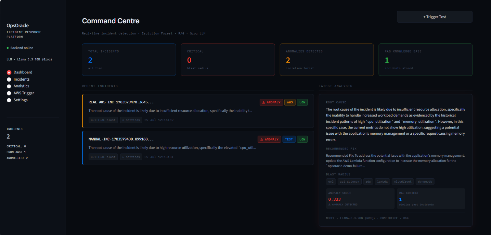
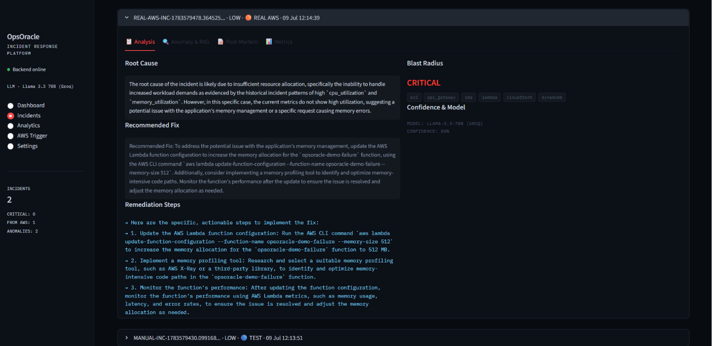
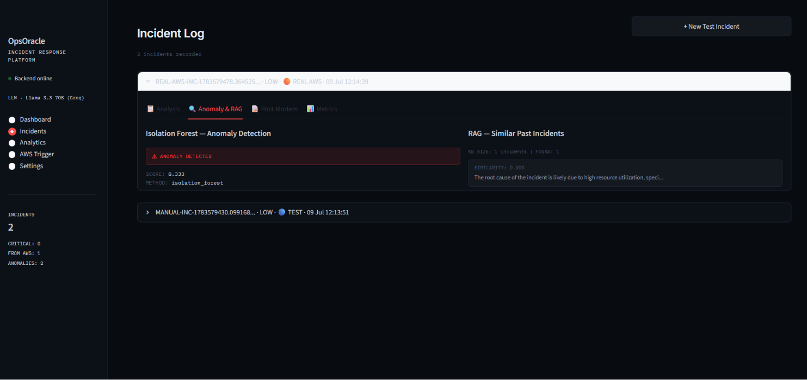
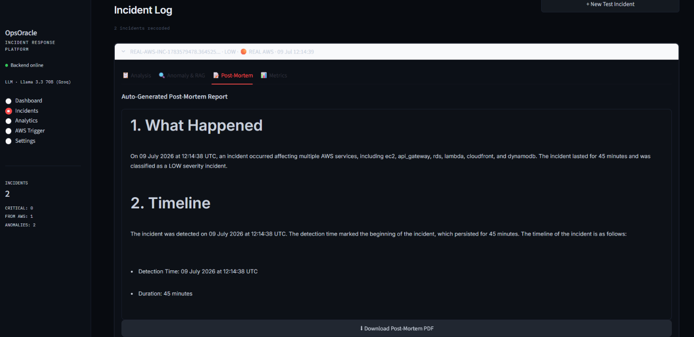
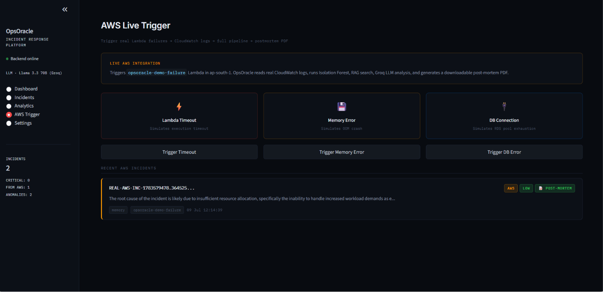
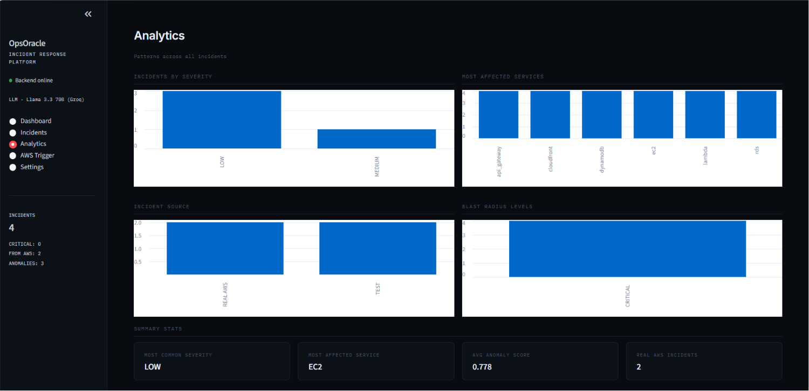

# OpsOracle — AI Incident Analysis for AWS

> When an AWS service fails, OpsOracle parses the logs, maps which other services are affected, checks the metrics for anomalies, finds similar past incidents (RAG), and asks Llama 3.3 70B for the root cause and a fix. It also writes a post-mortem report that you can download as a PDF.



---

## What It Does

Every incident goes through one function, `run_full_pipeline()` in `backend/routers/incidents.py`:

1. **Parse logs** (`log_parser.py`): regular expressions pull out timestamps, error types and services.
2. **Map the blast radius** (`blast_radius_service.py`): a depth-first search over a service dependency graph finds every service affected by the failure, and rates the impact level.
3. **Check metrics for anomalies** (`anomaly_detector.py`): scores 5 metrics: CPU, memory, latency, error rate and request count. It uses an Isolation Forest when a trained model is present, and threshold rules otherwise.
4. **Find similar past incidents (RAG)** (`rag_service.py`): embeds the logs with `all-MiniLM-L6-v2` and returns the 3 most similar stored incidents by cosine similarity.
5. **Analyse with an LLM** (`llm_agent.py`): sends the parsed logs, metrics, blast radius and similar incidents to Llama 3.3 70B on Groq. It returns the root cause, a recommended fix with AWS CLI commands, a severity (CRITICAL / HIGH / MEDIUM / LOW) and step-by-step remediation.
6. **Write a post-mortem** (`llm_agent.py`): the LLM writes a 7-section report: What Happened, Timeline, Root Cause, Impact, Resolution, Lessons Learned, Action Items.
7. **Store the incident**: it is saved and added to the RAG memory, so later incidents can find it.

The post-mortem is turned into a PDF with ReportLab when the user downloads it.

**OpsOracle recommends fixes; it does not change your AWS resources on its own.** An engineer reviews and applies the fix. A separate, permission-gated remediation module is described below.

---

## Screenshots

### Dashboard


### Incident Analysis — Root Cause, Fix, Blast Radius


### Anomaly Detection and RAG Context


### Post-Mortem Report


### AWS Live Trigger — Real Lambda Failures


### Analytics


---

## Architecture

```
Streamlit dashboard  (frontend/app.py, port 8501)
        │  HTTP + JSON, using the requests library
        ▼
FastAPI backend      (backend/main.py, port 8000)
        │
        ├── POST /api/incidents/analyze               ← test incident from the dashboard
        └── POST /api/incidents/trigger-aws-incident  ← real failure
                 └── aws_manager.py (boto3): invoke the Lambda,
                     read its CloudWatch logs and metrics
                                │
                                ▼
                     run_full_pipeline()
   1. log_parser                 → structured log data
   2. blast_radius_service       → affected services + impact level
   3. anomaly_detector           → anomaly score (Isolation Forest or thresholds)
   4. rag_service                → top 3 similar past incidents
   5. llm_agent  (Groq)          → root cause, fix, severity, steps
   6. llm_agent  (Groq)          → post-mortem text
   7. alert_service + rag_service → store the incident, add it to RAG memory
                                │
                                ▼
          JSON response → dashboard     |     PDF on download (ReportLab)
```

---

## Tech Stack

| Layer | Technology | Used for |
|---|---|---|
| Backend | FastAPI, Uvicorn, Pydantic | REST API, server, request models |
| LLM | Groq API — `llama-3.3-70b-versatile` | root cause, fix, severity, steps, post-mortem (temperature 0.3) |
| Embeddings | Sentence Transformers — `all-MiniLM-L6-v2` | 384-dimension vectors, runs locally |
| Vector search | NumPy | cosine similarity over an in-memory list, top 3 |
| Anomaly detection | scikit-learn `IsolationForest` + `StandardScaler`, Joblib | anomaly scoring; saving the trained model |
| Cloud | boto3 | Lambda, CloudWatch metrics, CloudWatch Logs, EC2, X-Ray |
| Frontend | Streamlit, requests | dashboard and calls to the backend |
| PDF | ReportLab | post-mortem PDF |
| Logging | Loguru | console and log-file output with rotation |
| Config | python-dotenv | loads API keys from `.env` |

---

## How RAG Works Here

| Step | What happens | Where |
|---|---|---|
| Store | Each new incident becomes a short text (error type, root cause, service, fix) and is embedded into a 384-number vector | `RAGService.add_incident()` |
| Vector store | Vectors are kept in a Python list in memory | `RAGService.incident_memory` |
| Query | The new incident's raw logs are embedded with the same model | `search_similar_incidents()` |
| Search | Cosine similarity against every stored vector; the top 3 are returned | `search_similar_incidents()` |
| Context | The similar incidents are added to the LLM prompt | `llm_agent.analyze_incident()` |

Incidents are short, so each incident is stored as one vector, with no chunking. If there is no history yet, the LLM analyses the incident without past context.

---

## Anomaly Detection

- **Features:** `cpu_utilization`, `memory_utilization`, `request_latency`, `error_rate`, `request_count`
- **Model:** `IsolationForest(contamination=0.1, n_estimators=100, random_state=42)` on `StandardScaler`-scaled features. `train()` saves the model and scaler to `ml_models/` with Joblib.
- **Current state:** the repository does not include a trained model, so the detector uses **threshold rules** until `train()` is run on normal (baseline) metrics.
- **Real Lambda incidents:** CloudWatch gives `Errors`, `Duration` and `Throttles` for Lambda. The 5 features are calculated from these, because Lambda does not publish CPU or memory usage.

---

## Remediation

The main pipeline only **recommends** a fix. A separate module, `backend/agents/remediation_agent.py`, is reached through `POST /api/remediation/execute` and uses permission levels:

| Permission level | Behaviour |
|---|---|
| 1 (default) | returns a suggestion only |
| 2 and above | executes the action |

| Fix type | What it does at level 2+ |
|---|---|
| `restart_lambda` | re-invokes the Lambda function |
| `scale_ec2` | stops the instance, changes its type, starts it again |
| `increase_memory`, `increase_timeout`, `clear_connection_pool` | placeholders; not yet connected to AWS |

---

## Project Structure

```
OpsOracle/
├── backend/
│   ├── main.py                    # FastAPI app, CORS, routers, startup config check
│   ├── config.py                  # reads settings and API keys from .env
│   ├── routers/
│   │   ├── incidents.py           # run_full_pipeline() + incident endpoints
│   │   ├── metrics.py             # CloudWatch metrics and X-Ray endpoints
│   │   ├── remediation.py         # remediation endpoints
│   │   └── postmortem.py          # post-mortem endpoints
│   ├── services/
│   │   ├── log_parser.py          # log parsing with regular expressions
│   │   ├── blast_radius_service.py# service dependency graph (DFS)
│   │   ├── rag_service.py         # embeddings + cosine similarity search
│   │   ├── aws_manager.py         # all boto3 calls
│   │   ├── alert_service.py       # in-memory incident store
│   │   └── rag_engine.py          # earlier RAG version (not used)
│   ├── agents/
│   │   ├── llm_agent.py           # Groq LLM: analysis + post-mortem
│   │   └── remediation_agent.py   # permission-gated remediation
│   ├── ml/
│   │   └── anomaly_detector.py    # Isolation Forest + threshold fallback
│   └── utils/
│       ├── pdf_generator.py       # ReportLab PDF
│       ├── embeddings.py
│       └── logging_config.py
├── frontend/
│   └── app.py                     # Streamlit dashboard
├── models/
│   └── schemas.py                 # Pydantic request/response models
├── data/
│   └── incident_history.json      # sample incident
├── tests/
│   └── test_st.py                 # checks that the embedding model loads
├── docs/                          # screenshots
├── requirements.txt
└── .env                           # API keys (not committed)
```

---

## Quick Start

**Requirements:** Python 3.12, a free Groq API key, and AWS credentials. The backend checks for `GROQ_API_KEY`, `AWS_ACCESS_KEY_ID` and `AWS_SECRET_ACCESS_KEY` at startup.

### 1. Clone

```bash
git clone https://github.com/Gaurav-Sindhi/OpsOracle.git
cd OpsOracle
```

### 2. Create a virtual environment

```bash
python -m venv venv
venv\Scripts\activate        # Windows
source venv/bin/activate     # Mac/Linux
```

### 3. Install dependencies

```bash
pip install -r requirements.txt
```

### 4. Create a `.env` file in the project root

```
GROQ_API_KEY=your_groq_key
AWS_ACCESS_KEY_ID=your_aws_access_key
AWS_SECRET_ACCESS_KEY=your_aws_secret_key
AWS_REGION=ap-south-1
LOG_LEVEL=INFO
LOG_FILE=logs/opsoracle.log
```

Get a free Groq API key at https://console.groq.com/keys

### 5. Run the backend

```bash
python -m backend.main
```

API: `http://localhost:8000` · Swagger docs: `http://localhost:8000/docs`

### 6. Run the frontend (in a second terminal)

```bash
streamlit run frontend/app.py
```

Dashboard: `http://localhost:8501`

---

## Testing the Pipeline

### Option A — From the dashboard

Click **"+ Trigger Test"** on the Dashboard page.

### Option B — From Swagger

Open `http://localhost:8000/docs` → `POST /api/incidents/analyze`:

```json
{
  "logs": {
    "summary": "Lambda function timeout error detected",
    "error_count": 15,
    "warning_count": 3
  },
  "metrics": {
    "cpu_utilization": 92,
    "memory_utilization": 88,
    "request_latency": 850,
    "error_rate": 0.35,
    "request_count": 1200
  },
  "service": "lambda"
}
```

### Option C — Real AWS failure

Open the **AWS Trigger** page and click one of the 3 failure buttons (timeout, memory, connection). This needs a Lambda function named `opsoracle-demo-failure` in your AWS account that fails according to the `failure_type` in its input. The code for this Lambda is not included in this repository.

---

## Main API Endpoints

| Method | Endpoint | Description |
|---|---|---|
| GET | `/` | Health check |
| POST | `/api/incidents/analyze` | Run the full pipeline on a test incident |
| POST | `/api/incidents/trigger-aws-incident` | Invoke the demo Lambda and analyse the real failure (query parameter: `failure_type`) |
| GET | `/api/incidents/` | List incidents (query parameters: `limit`, `offset`) |
| GET | `/api/incidents/{incident_id}` | Get one incident |
| GET | `/api/incidents/{incident_id}/postmortem` | Get the post-mortem text |
| GET | `/api/incidents/{incident_id}/postmortem/pdf` | Download the post-mortem PDF |
| POST | `/api/remediation/execute` | Run or suggest a remediation (body: `fix_type`, `parameters`, `permission_level`) |

All endpoints, including metrics and remediation history, are listed in Swagger at `/docs`.

---

## Known Limitations

- Incidents and RAG memory are kept in memory, so they are lost when the backend restarts.
- No trained anomaly model ships with the repo; threshold rules run until the Isolation Forest is trained.
- Each incident makes 5 separate LLM calls, one after another.
- The `/analyze` endpoint accepts a plain dictionary; the Pydantic models in `models/schemas.py` are not connected yet.
- The service dependency graph is a fixed map of 7 AWS services.
- No authentication on the API.

---

## Roadmap

| Area | Now | Next |
|---|---|---|
| Incident storage | In-memory list | DynamoDB or PostgreSQL |
| Vector store | In-memory list + NumPy | Pinecone or FAISS |
| Anomaly detection | Threshold rules until trained | Isolation Forest trained on baseline metrics |
| LLM calls | 5 calls per incident | One call returning structured JSON |
| Long logs | One vector per incident | Chunking with LangChain's `RecursiveCharacterTextSplitter` |
| Validation | Plain dictionary | Pydantic request models |
| Remediation | Suggestions | Human-approved execution with an audit log |
| Deployment | Local | Docker on AWS ECS |
| Security | No auth | API key or JWT |

---

## Built By

**Gaurav Sindhi** — B.Tech AI & ML, R. C. Patel Institute of Technology, Shirpur (2026)

[](https://linkedin.com/in/gaurav-sindhi-bb085b257)
[](https://github.com/Gaurav-Sindhi)
